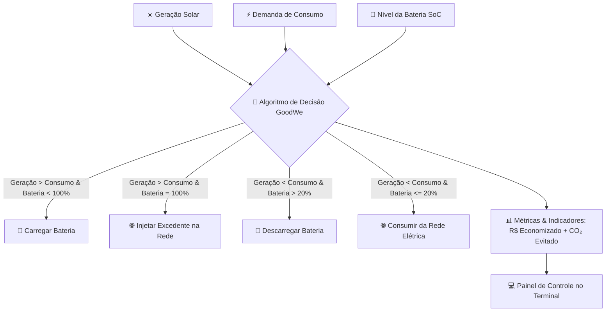

# ☀️ GoodWe Smart Energy — Solução Integrada de Gestão Energética

> **Sprint 4 — Solução Final Integrada e Inovadora GoodWe**  
> Sistema inteligente para monitoramento, simulação e tomada de decisão autônoma no fluxo de geração solar, armazenamento em baterias e consumo sustentável.

---

## 👥 Integrantes
* **Gustavo Zagato Bottechia** — RM: 569420
* **Davi Q. Zuolo** — RM: 571669
* **Daniel Vilela Mana** — RM: 571632
* **Kayo Henderson** — RM: 570706

---

## 📌 Visão Geral do Projeto
O **GoodWe Smart Energy** é uma aplicação interativa desenvolvida em Python que emula a inteligência embarcada dos inversores híbridos e sistemas de armazenamento de energia (ESS) da **GoodWe**.

Executado diretamente no terminal/console (sem necessidade de navegadores ou servidores externos), o sistema monitora variáveis de geração fotovoltaica, demanda de carga e estado de carga (SoC) da bateria em tempo real, aplicando algoritmos de decisão para priorizar o autoconsumo verde, otimizar o banco de baterias, mitigar o uso da concessionária e calcular a redução da pegada de carbono.

---

## 🎯 Alinhamento ao Desafio GoodWe & Sustentabilidade
* **Inversores Híbridos & ESS GoodWe:** O software replica a lógica operacional dos inversores inteligentes da GoodWe (ex.: séries ET/EH/ES), alternando dinamicamente entre geração direta, carga/descarga da bateria e injeção/consumo da rede.
* **Eficiência & Autoconsumo:** Maximização do aproveitamento da energia solar gerada localmente.
* **Impacto Ambiental Positivo:** Cálculo e exibição em tempo real do volume de $CO_2$ evitado (fator de emissão baseado na matriz energética).
* **Economia Financeira:** Redução da fatura de energia mediante minimização de compras da distribuidora nos horários de ponta.

---

## 🏗️ Arquitetura do Sistema

### Fluxo Operacional



---

## 📁 Estrutura de Pastas e Módulos

```text
sprint4_Energia_Sustentavel/
│
├── src/
│   ├── __init__.py
│   ├── simulation.py       # Gerador estocástico de dados (geração, consumo, bateria)
│   ├── energy_manager.py   # Regras de negócio e tomada de decisão do inversor GoodWe
│   └── calculations.py     # Cálculos tarifários e pegada de carbono (CO2)
│
├── main.py                 # Ponto de entrada do sistema (menu interativo no terminal)
├── requirements.txt        # Especificação de dependências (bibliotecas nativas)
└── README.md               # Documentação técnica e guia do projeto
```

| Módulo / Arquivo | Responsabilidade |
| :--- | :--- |
| [`main.py`](file:///C:/Users/Administrador/PycharmProjects/sprint4_Energia_Sustentavel/main.py) | Menu interativo no console, relatórios, gráficos de barras ASCII e simulação contínua. |
| [`src/simulation.py`](file:///C:/Users/Administrador/PycharmProjects/sprint4_Energia_Sustentavel/src/simulation.py) | Gera dados de simulação estocástica (solar: 2–10 kW, consumo: 2–8 kW, bateria: 20–90%). |
| [`src/energy_manager.py`](file:///C:/Users/Administrador/PycharmProjects/sprint4_Energia_Sustentavel/src/energy_manager.py) | Lógica de decisão autônoma simulando o inversor híbrido GoodWe. |
| [`src/calculations.py`](file:///C:/Users/Administrador/PycharmProjects/sprint4_Energia_Sustentavel/src/calculations.py) | Cálculos de energia líquida da rede, estimativa de custo (R$) e carbono evitado ($CO_2$). |

---

## 📊 Recursos e Funcionalidades no Terminal

1. **Simulação de Ciclo Único:** Executa um ciclo instantâneo com geração de dados e relatório analítico completo.
2. **Simulação Contínua (5 Ciclos):** Simula a dinâmica temporal da microrrede com consolidação de métricas acumuladas.
3. **Cenário Personalizado:** Permite ao usuário digitar valores próprios de geração, consumo e bateria para testar decisões do inversor.
4. **Gráfico Comparativo em ASCII:** Visualização rápida de Geração vs. Consumo no próprio console.
5. **Barra de Carga da Bateria (SoC):** Medidor visual com proteção de descarga profunda (limite de 20%).

---

## 🚀 Como Executar o Projeto

### Pré-requisitos
* Python 3.10 ou superior instalado.

### 1. No PyCharm (Forma Mais Simples)
1. Abra o arquivo [`main.py`](file:///C:/Users/Administrador/PycharmProjects/sprint4_Energia_Sustentavel/main.py).
2. Clique no botão verde de **Run** (Executar) ou pressione `Shift + F10`.
3. Interaja diretamente com o menu no painel de saída/console.

### 2. Pelo Terminal / Prompt de Comando
```bash
python main.py
```

---

## 🛠️ Tecnologias Utilizadas
* **Linguagem:** Python 3 (Bibliotecas nativas)
* **Arquitetura Modular:** Separação clara entre camada de apresentação (`main.py`) e lógica de domínio (`src/`)
* **Controle de Versão:** Git & GitHub
